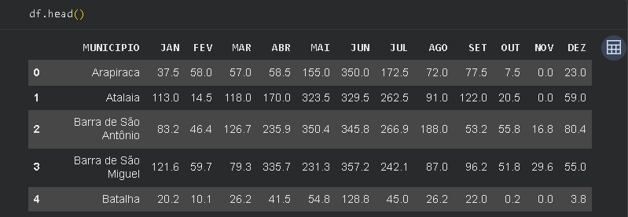
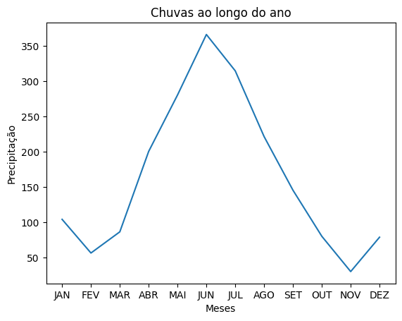
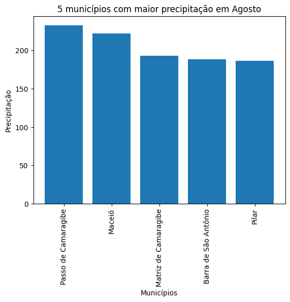

# Trabalho de Estatística e Gráfico
>### O trabalho tem o objetivo de fazer uma análise dos índices pluviométricos dos municípios de Alagoas utilizando Python, através de cálculos estatísticos e gráficos para identificar padrões de precipitação ao longo do ano.

### Importação das bibliotecas
```python
import pandas as pd
import matplotlib.pyplot as plt
import plotly.express as px
```
- Pandas (`pd`): utilizada para leitura e manipulação dos dados.

- Matplotlib (`plt`): utilizada para criação dos gráficos.

- Plotly Express (`px`): utilizada para criação de gráficos interativos.

- Os apelidos (`pd`, `plt`, `px`) facilitam a escrita dos comandos.
#
### Leitura e visualização inicial dos dados
### O arquivo utilizado neste trabalho pode ser acessado abaixo:
[chuvas_AL_2023.csv](dados/chuvas_AL_2023.csv)

```python
df = pd.read_csv("chuvas_AL_2023.csv", sep=";")
df.head()
```
### Resultado obtido:


- `read_csv()` foi utilizado para ler o arquivo CSV contendo os dados pluviométricos dos municípios.
  
- `sep=";"` define os dados do arquivo separados por ponto e vírgula.
  
- `df` é o DataFrame principal utilizado no trabalho, onde estão as principais informações.
  
- `head()` foi utilizado para visualizar as primeiras 5 linhas da tabela e verificar se os dados foram carregados corretamente.
#
## Perguntas Norteadoras:
### Volume total de precipitação registrado no estado de Alagoas no mês de Junho:

```python
round(df["JUN"].sum(), 2)
```

- `df["JUN"]` seleciona apenas a coluna do mês de Junho.
  
- `sum()` foi utilizado para somar todos os valores de precipitação presentes nessa coluna.
  
- `round(valor, 2)` foi utilizado para arredondar o resultado para 2 casas decimais.

### Resultado obtido:
    17785.00

### Média de chuvas ocorrida nos municípios alagoanos durante o mês de Janeiro:

```python
round(df["JAN"].mean(), 2)
```

- `df["JAN"]` seleciona apenas a coluna do mês de Janeiro.

- `mean()` foi utilizado para calcular a média aritmética dos valores da coluna.

- `round(valor, 2)` foi utilizado para arredondar o resultado para 2 casas decimais.

### Resultado obtido:
    72.19

### Município obteve o maior e qual obteve o menor índice pluviométrico no mês de Fevereiro:

```python
df.loc[df["FEV"].idxmax(), "MUNICIPIO"]

df.loc[df["FEV"].idxmin(), "MUNICIPIO"]
```

- `df["FEV"]` seleciona apenas a coluna do mês de Fevereiro.

- `idxmax()` retorna o índice onde está localizado o maior valor da coluna.

- `idxmin()` retorna o índice onde está localizado o menor valor da coluna.

- `loc[linha, coluna]` foi utilizado para localizar informações específicas dentro da tabela.

### Resultado obtido:

    Maior índice pluviométrico:
    Joaquim Gomes

    Menor índice pluviométrico:

### Análise do comportamento das chuvas em Maceió ao longo do ano:

```python
meses=["JAN","FEV","MAR","ABR","MAI","JUN","JUL","AGO","SET","OUT","NOV","DEZ"]

cidade = df[df["MUNICIPIO"] == "Maceió"]

plt.plot(meses, cidade[meses].values[0])

plt.title("Chuvas ao longo do ano")

plt.xlabel("Meses")

plt.ylabel("Precipitação")

plt.show()
```
### Resultado obtido:


- `meses` é uma lista feita para armazenar os meses utilizados no eixo horizontal do gráfico.

- `df[df["MUNICIPIO"] == "Maceió"]` filtra a tabela e seleciona apenas os dados referentes ao município escolhido.

- `cidade` é a variável utilizada para armazenar os dados filtrados.

- `plt.plot()` cria um gráfico de linhas utilizando os meses no eixo X e os valores de precipitação no eixo Y.

- `cidade[meses].values[0]` seleciona os valores numéricos que serão utilizados no gráfico.

- `plt.title()` adiciona um título ao gráfico.

- `plt.xlabel()` define o nome do eixo horizontal (X).

- `plt.ylabel()` define o nome do eixo vertical (Y).

- `plt.show()` exibe o gráfico gerado.

### Os 5 municípios com o maior volume de precipitação em Agosto:

```python
top5_agosto = df.sort_values("AGO", ascending=False).head(5)

plt.bar(top5_agosto["MUNICIPIO"], top5_agosto["AGO"])

plt.title("5 municípios com maior precipitação em Agosto")

plt.xlabel("Municípios")

plt.ylabel("Precipitação")

plt.xticks(rotation=90)

plt.show()
```
### Resultado obtido:


- `sort_values("AGO", ascending=False)` ordena os municípios do maior para o menor valor de precipitação em Agosto.

- `head(5)` seleciona apenas os 5 municípios com maiores índices.

- `top5_agosto` é uma variável feita para armazenar essas informações.

- `plt.bar()` cria um gráfico de barras para comparação entre os municípios.

- `top5_agosto["MUNICIPIO"]` define os municípios no eixo horizontal.

- `top5_agosto["AGO"]` define os valores de precipitação no eixo vertical.

- `plt.title()` adiciona um título ao gráfico.

- `plt.xlabel()` define o nome do eixo X.

- `plt.ylabel()` define o nome do eixo Y.

- `plt.xticks(rotation=90)` gira os nomes dos municípios em noventa graus para facilitar a visualização.

- `plt.show()` mostra o gráfico.


### Comparação pluviométrica entre regiões de Alagoas

```python id="8yyscf"
cidade1 = df[df["MUNICIPIO"] == "Maceió"]

cidade2 = df[df["MUNICIPIO"] == "União dos Palmares"]

cidade3 = df[df["MUNICIPIO"] == "Arapiraca"]

cidade4 = df[df["MUNICIPIO"] == "Santana do Ipanema"]

meses = ["JAN", "JUN", "NOV"]
```
- Foram selecionados 4 municípios representando diferentes regiões do estado.

- `df[df["MUNICIPIO"] == "..."]` foi utilizado para filtrar individualmente cada município.

- A lista `meses` foi criada contendo apenas os meses solicitados na atividade (`JAN`, `JUN` e `NOV`).

- `cidadeX[meses].values[0]` seleciona os valores correspondentes aos meses escolhidos.
  
```python id="8yyscf"
plt.bar(meses, cidade1[meses].values[0], label="Maceió")

plt.bar(meses, cidade2[meses].values[0], alpha=0.7, label="União dos Palmares")

plt.bar(meses, cidade3[meses].values[0], alpha=0.5, label="Arapiraca")

plt.bar(meses, cidade4[meses].values[0], alpha=0.3, label="Santana do Ipanema")

plt.title("Comparação de precipitação entre regiões")

plt.xlabel("Meses")

plt.ylabel("Precipitação")

plt.legend()

plt.show()
```

- `plt.bar()` cria gráficos de barras para comparação entre os municípios.

- O parâmetro `alpha` foi utilizado para alterar a transparência das barras e facilitar a visualização.

- `plt.title()` adiciona um título ao gráfico.

- `plt.xlabel()` define o eixo horizontal.

- `plt.ylabel()` define o eixo vertical.

- `plt.legend()` cria uma legenda identificando cada município.

- `plt.show()` exibe o gráfico.

